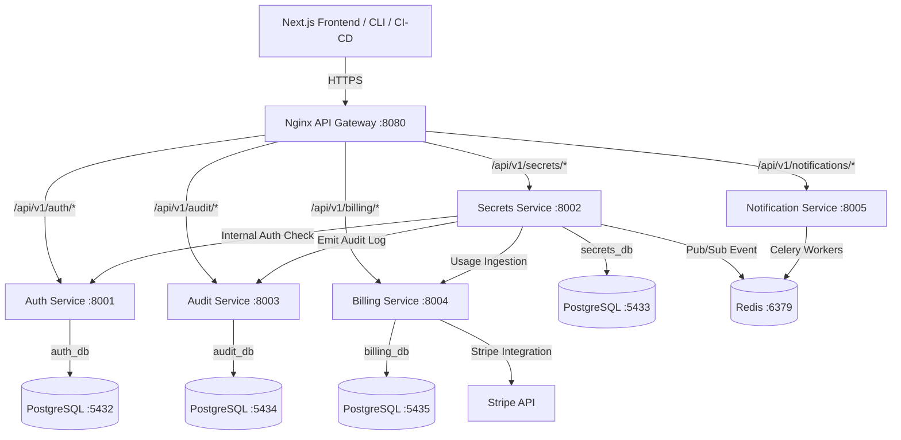

# EnvVault

> Centralized, multi-tenant secrets and environment variable management SaaS for development teams.

EnvVault allows engineering teams to centrally manage, encrypt, version, and audit-log all secrets and environment variables across multiple projects and deployment environments (development, staging, production, etc.).

---

## 🏗️ High-Level Design (HLD)

EnvVault is built using a modern **microservices architecture** with a Next.js frontend, an Nginx API Gateway, and independent Django REST Framework backend services. 

### 1. Architectural Component Diagram



### 2. High-Level Design Component Breakdown

The system decomposes into several self-contained components:

| Component | Responsibility | Technology |
|---|---|---|
| **API Gateway** | Entry point, routing, TLS, rate-limiting, authentication token verification. | Nginx |
| **Auth Service** | Multi-tenant organization boundaries, user registration, JWT generation/verification, RBAC rules. | Django REST Framework, SimpleJWT |
| **Secrets Service** | Secrets CRUD lifecycle, AES-256-GCM encryption/decryption, environment segregation. | Django REST Framework, Cryptography |
| **Audit Service** | Append-only store for compliance logging. Ingests event logs from other services asynchronously. | Django REST Framework |
| **Billing Service** | Meters secret reads per organization, integrates with Stripe Billing API. | Django REST Framework, Stripe API |
| **Notification Service** | Background worker system triggering Slack channel messages, emails, or webhooks. | Django, Celery, Redis |

### 3. Request Processing Flow (Sync & Async)
1. **Sync Path:** The developer CLI triggers a pull command (`envvault pull`). The request goes through the **API Gateway** → authenticated by the **Auth Service** → processed by the **Secrets Service** which decrypts the values using base64-encoded organisation keys and returns them.
2. **Async Audit Path:** On a successful read, the Secrets Service triggers an async call to the **Audit Service** to log the read operation, recording the actor ID, key, IP address, and timestamp.
3. **Async Billing & Alerts Path:** Concurrently, the Secrets Service pushes a message into the **Redis Pub/Sub** bus. 
   - The **Billing Service** consumes it and increments the organization's read counter.
   - The **Notification Service** consumes it and triggers background Celery tasks to deliver Slack alerts or webhook payloads if access rules specify.

---

## 💾 Low-Level Design (LLD)

### 1. Database Schema (Database-per-Service)

To enforce strict isolation, each microservice operates on its own dedicated PostgreSQL database instance. No cross-service SQL joins are permitted.

#### A. `auth_db` (User & Tenant Space)
```sql
-- organisations
CREATE TABLE organisations (
    id UUID PRIMARY KEY DEFAULT gen_random_uuid(),
    name VARCHAR(255) NOT NULL,
    slug VARCHAR(100) UNIQUE NOT NULL,
    plan VARCHAR(50) DEFAULT 'free',
    created_at TIMESTAMPTZ DEFAULT NOW()
);

-- users
CREATE TABLE users (
    id UUID PRIMARY KEY DEFAULT gen_random_uuid(),
    email VARCHAR(255) UNIQUE NOT NULL,
    password_hash VARCHAR(255) NOT NULL,
    is_active BOOLEAN DEFAULT TRUE,
    created_at TIMESTAMPTZ DEFAULT NOW()
);

-- members (org <-> user with role)
CREATE TABLE members (
    id UUID PRIMARY KEY DEFAULT gen_random_uuid(),
    org_id UUID REFERENCES organisations(id) ON DELETE CASCADE,
    user_id UUID REFERENCES users(id) ON DELETE CASCADE,
    role VARCHAR(50) DEFAULT 'viewer', -- owner | admin | editor | viewer
    created_at TIMESTAMPTZ DEFAULT NOW(),
    UNIQUE(org_id, user_id)
);

-- projects
CREATE TABLE projects (
    id UUID PRIMARY KEY DEFAULT gen_random_uuid(),
    org_id UUID REFERENCES organisations(id) ON DELETE CASCADE,
    name VARCHAR(255) NOT NULL,
    slug VARCHAR(100) NOT NULL,
    created_at TIMESTAMPTZ DEFAULT NOW(),
    UNIQUE(org_id, slug)
);

-- api_tokens
CREATE TABLE api_tokens (
    id UUID PRIMARY KEY DEFAULT gen_random_uuid(),
    project_id UUID REFERENCES projects(id) ON DELETE CASCADE,
    name VARCHAR(255),
    token_hash VARCHAR(255) NOT NULL,
    scopes TEXT[] DEFAULT '{read}',
    expires_at TIMESTAMPTZ,
    last_used_at TIMESTAMPTZ,
    created_at TIMESTAMPTZ DEFAULT NOW()
);
```

#### B. `secrets_db` (Encrypted Key-Value Space)
```sql
-- environments
CREATE TABLE environments (
    id UUID PRIMARY KEY DEFAULT gen_random_uuid(),
    project_id UUID NOT NULL, -- Logical reference, no hard FK constraint
    name VARCHAR(100) NOT NULL, -- production | staging | development | custom
    color VARCHAR(20) DEFAULT '#6366f1',
    created_at TIMESTAMPTZ DEFAULT NOW(),
    UNIQUE(project_id, name)
);

-- secrets
CREATE TABLE secrets (
    id UUID PRIMARY KEY DEFAULT gen_random_uuid(),
    environment_id UUID REFERENCES environments(id) ON DELETE CASCADE,
    key VARCHAR(500) NOT NULL,
    encrypted_value TEXT NOT NULL,
    iv VARCHAR(255) NOT NULL, -- AES-GCM IV (Initialization Vector)
    current_version INT DEFAULT 1,
    is_deleted BOOLEAN DEFAULT FALSE,
    created_at TIMESTAMPTZ DEFAULT NOW(),
    updated_at TIMESTAMPTZ DEFAULT NOW(),
    UNIQUE(environment_id, key)
);

-- secret_versions (append-only)
CREATE TABLE secret_versions (
    id UUID PRIMARY KEY DEFAULT gen_random_uuid(),
    secret_id UUID REFERENCES secrets(id) ON DELETE CASCADE,
    encrypted_value TEXT NOT NULL,
    iv VARCHAR(255) NOT NULL,
    version_number INT NOT NULL,
    created_by UUID NOT NULL, -- Logical reference to user id
    created_at TIMESTAMPTZ DEFAULT NOW()
);

CREATE INDEX idx_secret_versions_secret_id ON secret_versions(secret_id);
CREATE INDEX idx_secrets_environment_key ON secrets(environment_id, key) WHERE is_deleted = FALSE;
```

#### C. `audit_db` (Immutable Ingestion Log)
```sql
-- audit_events (append-only, never updated or deleted)
CREATE TABLE audit_events (
    id UUID PRIMARY KEY DEFAULT gen_random_uuid(),
    org_id UUID NOT NULL,
    project_id UUID NOT NULL,
    environment_name VARCHAR(100),
    actor_type VARCHAR(50) NOT NULL, -- 'member' | 'api_token'
    actor_id UUID NOT NULL,
    actor_email VARCHAR(255),
    secret_key VARCHAR(500),
    action VARCHAR(100) NOT NULL, -- 'read' | 'write' | 'delete' | 'rollback' | 'export' | 'import'
    ip_address INET,
    user_agent TEXT,
    metadata JSONB,
    created_at TIMESTAMPTZ DEFAULT NOW()
);
```

#### D. `billing_db` (Metered Ingestion)
```sql
-- billing_accounts
CREATE TABLE billing_accounts (
    id UUID PRIMARY KEY DEFAULT gen_random_uuid(),
    org_id UUID UNIQUE NOT NULL,
    stripe_customer_id VARCHAR(255) UNIQUE,
    stripe_subscription_id VARCHAR(255),
    plan VARCHAR(50) DEFAULT 'free',
    billing_period_start TIMESTAMPTZ,
    billing_period_end TIMESTAMPTZ
);

-- usage_counters
CREATE TABLE usage_counters (
    id UUID PRIMARY KEY DEFAULT gen_random_uuid(),
    org_id UUID NOT NULL,
    period_start TIMESTAMPTZ NOT NULL,
    period_end TIMESTAMPTZ NOT NULL,
    secret_reads BIGINT DEFAULT 0,
    updated_at TIMESTAMPTZ DEFAULT NOW(),
    UNIQUE(org_id, period_start)
);
```

### 2. Encryption Implementation Details
Secrets are encrypted using envelope encryption. The organization's key is a 256-bit symmetric key (`ORG_KEY_DEFAULT` / KMS managed key), and cryptography's AES-256-GCM guarantees both confidentiality and ciphertext integrity.

```python
# utils/encryption.py
from cryptography.hazmat.primitives.ciphers.aead import AESGCM
import os, base64

def encrypt(plaintext: str, key_b64: str) -> tuple[str, str]:
    """Returns (ciphertext_b64, iv_b64)"""
    key = base64.b64decode(key_b64)
    iv = os.urandom(12)  # 96-bit nonce for GCM
    aesgcm = AESGCM(key)
    ct = aesgcm.encrypt(iv, plaintext.encode(), None)
    return base64.b64encode(ct).decode(), base64.b64encode(iv).decode()

def decrypt(ciphertext_b64: str, iv_b64: str, key_b64: str) -> str:
    """Returns plaintext string"""
    key = base64.b64decode(key_b64)
    iv = base64.b64decode(iv_b64)
    ct = base64.b64decode(ciphertext_b64)
    aesgcm = AESGCM(key)
    return aesgcm.decrypt(iv, ct, None).decode()
```

### 3. API Routes Design
Downstream services expose standardized JSON REST APIs through the Gateway routing system:

| Service | Verb | Endpoint | Purpose |
|---|---|---|---|
| **Auth** | `POST` | `/api/v1/auth/register` | Organization & owner initialization |
| | `POST` | `/api/v1/auth/login` | Obtains Access & Refresh JWT |
| | `POST` | `/api/v1/auth/api-tokens` | Provision Project API token |
| **Secrets** | `GET` | `/api/v1/secrets/{project}/{env}/` | List secrets of environment |
| | `POST` | `/api/v1/secrets/{project}/{env}/` | Add a new secret |
| | `POST` | `/api/v1/secrets/{project}/{env}/{key}/rollback/{version}/` | Rollback key to specified version |
| **Audit** | `GET` | `/api/v1/audit/events/` | Retrieve organization/project audit events |
| **Billing** | `GET` | `/api/v1/billing/usage/{org_id}/` | Get metered reads metrics |

---

## ✨ Features

- **🔐 Enterprise-Grade Envelope Encryption:** Secrets are encrypted on the write path using AES-256-GCM. Each organization gets a unique key generated using `cryptography` that is never stored in the database.
- **🔄 Secret Versioning & Rollback:** Every update automatically increments the version number. Easily view history and rollback to a previous version with a single click.
- **📁 Import/Export:** Import `.env` files directly or export secrets back to a `.env` format.
- **📋 Immutable Audit Logs:** Access logs detailing who read, updated, or exported a secret. Every operation is pushed to the append-only `audit-service`.
- **💳 Metered Billing:** Integrated Stripe billing. Free tier included, with usage-based meters tracking secret reads.
- **💻 Developer CLI & Integrations:** Pull secrets directly into local development or integrate with GitHub Actions, GitLab CI, and Kubernetes.

---

## 📂 Project Directory Structure

```directory
EnvVault/
├── cli/                        # Python CLI implementation (`envvault`)
│   ├── envvault_cli/           # CLI source code
│   └── setup.py                # Package setup script
├── frontend/                   # Next.js 14 Web UI App (App Router + Tailwind CSS)
│   ├── app/                    # Pages, layouts, and route handlers
│   ├── components/             # Reusable UI elements (Zustand state + React Hook Form)
│   └── store/                  # Zustand global state configurations
├── services/                   # Django REST Framework Backend Microservices
│   ├── auth-service/           # User registration, JWT tokens, RBAC, Organizations (:8001)
│   ├── secrets-service/        # Encryption/decryption, versions, CRUD (:8002)
│   ├── audit-service/          # Ingestion of events, append-only logger (:8003)
│   ├── billing-service/        # Stripe-integrated usage metrics & subscription plans (:8004)
│   └── notification-service/   # Slack integrations, webhooks, and email notifications (:8005)
├── infra/                      # Orchestration & Infrastructure Configs
│   ├── nginx/                  # Nginx configuration acting as the API Gateway
│   └── k8s/                    # Kubernetes Deployments, Services, HPAs, and ConfigMaps
└── docker-compose.yml          # Local multi-container development orchestrator
```

---

## 🛠️ Getting Started

### Prerequisites
Make sure you have the following installed on your machine:
* [Docker](https://www.docker.com/) and [Docker Compose](https://docs.docker.com/compose/)
* [Node.js](https://nodejs.org/) (v18+ recommended)
* [Python 3.10+](https://www.python.org/)

### Installation & Local Setup

1. **Clone the Repository:**
   ```bash
   git clone https://github.com/your-org/EnvVault.git
   cd EnvVault
   ```

2. **Configure Environment Variables:**
   Copy the example environment file and configure secrets as needed:
   ```bash
   cp .env.example .env
   ```

3. **Start the Platform via Docker Compose:**
   Deploy the database containers, Redis, microservices, frontend, and API Gateway:
   ```bash
   docker-compose up --build
   ```

4. **Verify the Running Containers:**
   Once services start, they are available on the following local ports:
   * **API Gateway:** `http://localhost:8080/api/v1`
   * **Web Frontend:** `http://localhost:3000`
   * **Auth Service:** `http://localhost:8001`
   * **Secrets Service:** `http://localhost:8002`
   * **Audit Service:** `http://localhost:8003`
   * **Billing Service:** `http://localhost:8004`
   * **Notification Service:** `http://localhost:8005`
   * **Redis:** `localhost:6379`

---

## 🔒 Security & Encryption Design

EnvVault implements a dual-key envelope encryption strategy:
1. **Secret Key (Database):** Encrypted value and IV (Initialization Vector) are stored in the database.
2. **Organization Key (KMS/Environment):** The key used to decrypt the data is stored in AWS KMS or as a base64 environment variable `ORG_KEY_DEFAULT` (locally) and is *never* persisted to the PostgreSQL database.

#### Encryption Helper Example:
```python
from cryptography.hazmat.primitives.ciphers.aead import AESGCM
import os, base64

def encrypt(plaintext: str, key_b64: str) -> tuple[str, str]:
    key = base64.b64decode(key_b64)
    iv = os.urandom(12)  # 96-bit nonce
    aesgcm = AESGCM(key)
    ct = aesgcm.encrypt(iv, plaintext.encode(), None)
    return base64.b64encode(ct).decode(), base64.b64encode(iv).decode()
```

---

## 💻 Developer CLI Usage

The EnvVault CLI allows developers to pull secrets down directly into local environment files or inject them into local shells.

1. **Install the CLI:**
   ```bash
   cd cli
   pip install -e .
   ```

2. **Login and Select Project:**
   ```bash
   envvault login --url http://localhost:8080
   envvault init --project my-project --env development
   ```

3. **Pull Secrets:**
   ```bash
   envvault pull -o .env
   ```

---

## 🚀 Future Roadmap & Extension Capabilities

To scale EnvVault into a fully featured enterprise platform, the following architectural and feature additions are planned:

### 1. Advanced Key Management (KMS & HSM)
* Integrate with **AWS KMS**, **GCP KMS**, **Azure Key Vault**, and hardware security modules (HSM) as encryption service providers.
* Support automatic key rotation of organization envelope keys with background decryption/re-encryption.

### 2. Dynamic & Ephemeral Secrets
* Move beyond static environment variables by generating **temporary credentials** on demand (e.g., temporary Postgres database users with 1-hour expiration or short-lived AWS IAM tokens).

### 3. Edge Delivery & Multi-Region Replication
* Support caching encrypted secrets at edge caches close to application servers.
* Enable multi-region replication of database instances for high-availability reads.

### 4. Policy Engine (ABAC / IP Restrictions)
* Implement Attribute-Based Access Control (ABAC). Define advanced routing and access rules such as:
  - Allowing secret access only from specific IP ranges (CIDRs) or inside a VPN.
  - resticting production write permissions to certain windows of time or requiring multi-party approvals.

### 5. Automated Rotation Webhooks
* Trigger custom webhooks when rotation periods expire to automatically refresh database passwords, third-party API credentials, or certificates.
