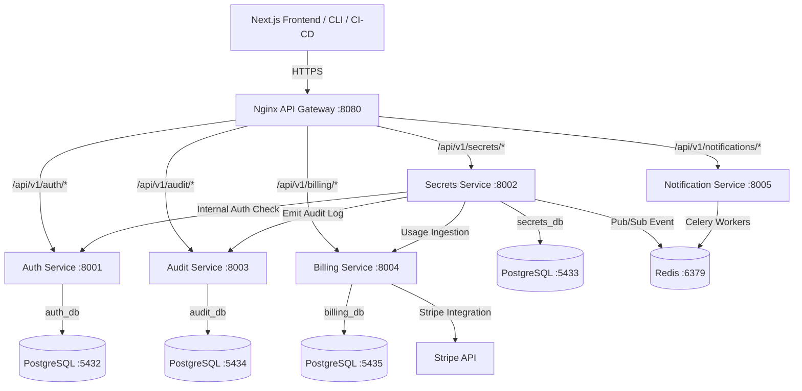
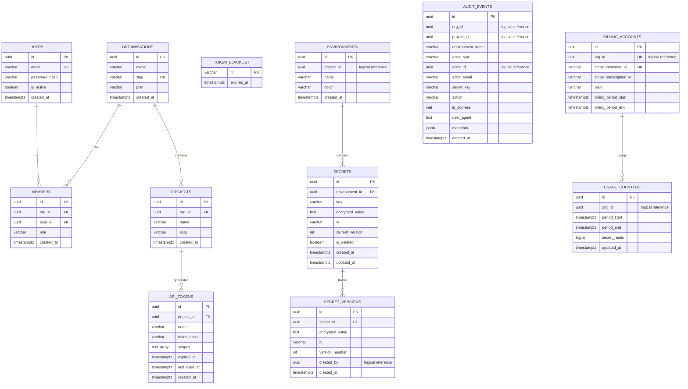
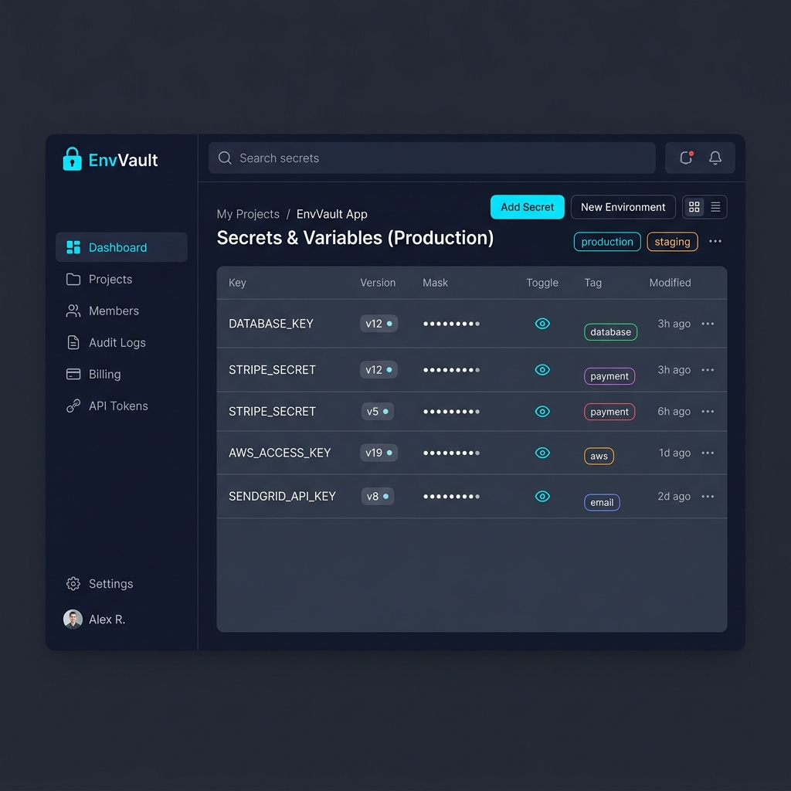

# EnvVault

Centralized, multi-tenant secrets and environment variable management SaaS for development teams.

---

## Table of Contents
1. [README](#readme)
2. [Architecture](#architecture)
3. [ER Diagram](#er-diagram)
4. [API Docs](#api-docs)
5. [Screenshots](#screenshots)
6. [Deployment](#deployment)
7. [CI/CD](#cicd)
8. [Docker](#docker)
9. [AWS](#aws)
10. [Live Link](#live-link)
11. [Blog](#blog)

---

# README

**EnvVault** is a multi-tenant SaaS platform that allows engineering teams to centrally manage, encrypt, version, and audit-log all secrets and environment variables across multiple projects and deployment environments (development, staging, production, etc.).

### Core Value Proposition
* **Centralized Store:** Manage secrets across your entire organization in a single dashboard.
* **Envelope Encryption:** Zero-trust security model. Secrets are encrypted with unique AES-256-GCM data keys, which are wrapped using organization-specific key encryption keys.
* **Environment Segregation:** Separate credentials by environment (e.g., development, staging, production) with role-based access control.
* **Immutable Audit Trail:** Append-only logging of all secret reads, writes, and modifications.
* **Metered Billing:** Fully integrated Stripe billing tracks secret access events to support usage-based pricing.
* **Developer CLI & CI/CD Integrations:** Official CLI tool and GitHub Actions to automate injecting configurations into development and production pipelines.

### Features
* **Secret Versioning:** Automatic version increments on change with one-click rollbacks.
* **Bulk Import/Export:** Paste `.env` file contents directly for rapid onboarding or download environment files with automated logging.
* **Slack & Webhook Alerts:** Real-time notifications for critical actions (e.g., access from new IP, bulk exports, near-expiry alerts).
* **Role-Based Access Control (RBAC):** Scoped user roles (`owner`, `admin`, `editor`, `viewer`) and scoped API tokens.

### Project Directory Structure
```text
EnvVault/
├── cli/                        # Python CLI implementation (`envvault`)
│   ├── envvault_cli/           # CLI source code
│   └── setup.py                # Package setup script
├── frontend/                   # Next.js 14 Web UI App (App Router + Tailwind CSS)
│   ├── app/                    # Pages, layouts, and route handlers
│   ├── components/             # Reusable UI elements (Zustand state + React Hook Form)
│   └── store/                  # Zustand global state configurations
├── services/                   # Django REST Framework Backend Microservices
│   ├── auth-service/           # User registration, JWT tokens, RBAC, Organizations (:8001)
│   ├── secrets-service/        # Encryption/decryption, versions, CRUD (:8002)
│   ├── audit-service/          # Ingestion of events, append-only logger (:8003)
│   ├── billing-service/        # Stripe-integrated usage metrics & subscription plans (:8004)
│   └── notification-service/   # Slack integrations, webhooks, and email notifications (:8005)
├── infra/                      # Orchestration & Infrastructure Configs
│   ├── nginx/                  # Nginx configuration acting as the API Gateway
│   └── k8s/                    # Kubernetes Deployments, Services, HPAs, and ConfigMaps
└── docker-compose.yml          # Local multi-container development orchestrator
```

---

# Architecture

EnvVault is built using a modern **microservices architecture** designed for high throughput, isolated data domains, and secure inter-service communication.

### Architectural Component Diagram


### High-Level Component Breakdown

| Component | Responsibility | Technology |
|---|---|---|
| **API Gateway** | Single entry point, path-based routing, TLS termination, global rate-limiting. | Nginx |
| **Auth Service** | Multi-tenant organization scopes, user registers, JWT generation/verification, RBAC rules. | Django REST Framework, SimpleJWT |
| **Secrets Service** | Secrets CRUD, AES-256-GCM envelope encryption/decryption, environment segregation. | Django REST Framework, Cryptography |
| **Audit Service** | Append-only store for compliance logging. Ingests events asynchronously. | Django REST Framework |
| **Billing Service** | Tracks secret reads per organization, integrates with Stripe Billing API. | Django REST Framework, Stripe API |
| **Notification Service** | Background worker system triggering Slack channel messages, emails, or webhooks. | Django, Celery, Redis |

### Request Processing Flows (Sync & Async)
1. **Sync Path:** The developer CLI triggers a pull command (`envvault pull`). The request enters the **API Gateway** → gets routed and authenticated by the **Auth Service** → gets processed by the **Secrets Service** which decrypts the values using base64-encoded organization keys and returns them.
2. **Async Audit Path:** On a successful read, the Secrets Service triggers an async call to the **Audit Service** to log the read operation, recording the actor ID, key, IP address, and timestamp.
3. **Async Billing & Alerts Path:** Concurrently, the Secrets Service pushes an event into **Redis Pub/Sub**.
   - The **Billing Service** worker consumes it and increments the organization's read counter.
   - The **Notification Service** worker consumes it and triggers background Celery tasks to deliver Slack alerts or webhooks if rules match.

---

# ER Diagram

To maintain strict service boundaries and isolation, each microservice operates on its own dedicated database (Database-per-Service pattern). No cross-service SQL joins are allowed. Logical constraints map relationships between databases.



---

# API Docs

All APIs are exposed through the API Gateway, prefixed with `/api/v1/`. Authenticate using the appropriate authorization headers:
* JWT Tokens: `Authorization: Bearer <jwt_access_token>`
* API Tokens: `Authorization: Token <api_token>`

### Endpoint Directory

| Service | Verb | Path | Description | Authentication |
|---|---|---|---|---|
| **Auth** | `POST` | `/api/v1/auth/register` | Initial registration of user & organization. | Public |
| | `POST` | `/api/v1/auth/login` | Login user, returning access and refresh JWT. | Public |
| | `POST` | `/api/v1/auth/token/refresh` | Refreshes active JWT access token. | Public |
| | `POST` | `/api/v1/auth/logout` | Revokes and blacklists active refresh token. | JWT Required |
| | `GET` | `/api/v1/auth/me` | Fetch active user profile and organizations. | JWT Required |
| | `POST` | `/api/v1/auth/projects` | Initialize a new project for an organization. | JWT Required |
| | `POST` | `/api/v1/auth/projects/{project_id}/tokens` | Provision a project API Token. | JWT Required |
| **Secrets** | `GET` | `/api/v1/secrets/{project_id}/{env}/` | List environment secrets (masked by default). | JWT or API Token |
| | `POST` | `/api/v1/secrets/{project_id}/{env}/` | Create a new secret (encrypts value). | JWT or API Token |
| | `GET` | `/api/v1/secrets/{project_id}/{env}/{key}/` | Decrypt and read single secret (triggers billing read count). | JWT or API Token |
| | `PUT` | `/api/v1/secrets/{project_id}/{env}/{key}/` | Modify existing secret value (creates new version). | JWT or API Token |
| | `DELETE` | `/api/v1/secrets/{project_id}/{env}/{key}/` | Soft-delete a secret. | JWT or API Token |
| | `GET` | `/api/v1/secrets/{project_id}/{env}/{key}/versions/` | Fetch version history for a specific secret. | JWT or API Token |
| | `POST` | `/api/v1/secrets/{project_id}/{env}/{key}/rollback/{version}/` | Revert key value to specified historic version. | JWT or API Token |
| | `POST` | `/api/v1/secrets/{project_id}/{env}/import/` | Bulk-import secrets from `.env` payload. | JWT or API Token |
| | `GET` | `/api/v1/secrets/{project_id}/{env}/export/` | Export environment secrets as `.env` format. | JWT or API Token |
| **Audit** | `GET` | `/api/v1/audit/events/` | Query list of organization audit events. | JWT Required |
| | `GET` | `/api/v1/audit/events/export/` | Export audit log dataset as CSV format. | JWT Required |
| **Billing** | `GET` | `/api/v1/billing/usage/{org_id}/` | Get metrics on secret reads and billing period. | JWT Required |
| | `POST` | `/api/v1/billing/checkout/` | Initiates Stripe portal/checkout session. | JWT Required |
| **Notify** | `PUT` | `/api/v1/notifications/settings/{org_id}/` | Update Slack integration hooks and webhooks. | JWT Required |

---

# Screenshots

Here is a visual overview of the EnvVault Management Dashboard, displaying real-time environment scopes, masked secret keys, and organization activity stats:



---

# Deployment

EnvVault is packaged and configured for cloud-native orchestration inside **Kubernetes (K8s)**.

### Deployment Environments

| Environment | Trigger | Cluster Target | URL |
|---|---|---|---|
| **Development** | Manual `docker-compose` | Local Docker | `localhost:3000` |
| **Staging** | Automatic merge to `main` | K8s staging namespace | `staging.envvault.io` |
| **Production** | Git Version Tag (`v*.*.*`) | K8s production namespace | `app.envvault.io` |

### Kubernetes Namespace Layout
All production containers run in the `envvault-production` namespace:
* **Deployments:**
  * `auth-service` (replicas: 2, scales up to 6 via HPA)
  * `secrets-service` (replicas: 3, scales up to 10 via HPA)
  * `audit-service` (replicas: 2, scales up to 4 via HPA)
  * `billing-service` (replicas: 1, scales up to 3 via HPA)
  * `notification-service` (replicas: 1, hosts worker threads)
  * `frontend` (replicas: 2, scales up to 6 via HPA)
* **StatefulSets:**
  * Databases: `postgres-auth`, `postgres-secrets`, `postgres-audit`, `postgres-billing`
  * Cache/Broker: `redis`

### Secrets Service Deployment Spec Example
```yaml
apiVersion: apps/v1
kind: Deployment
metadata:
  name: secrets-service
  namespace: envvault-production
spec:
  replicas: 3
  selector:
    matchLabels:
      app: secrets-service
  template:
    metadata:
      labels:
        app: secrets-service
    spec:
      containers:
        - name: secrets-service
          image: ghcr.io/your-org/envvault-secrets-service:v1.0.0
          ports:
            - containerPort: 8002
          envFrom:
            - secretRef:
                name: secrets-service-env
          resources:
            requests:
              cpu: 250m
              memory: 256Mi
            limits:
              cpu: 500m
              memory: 512Mi
          readinessProbe:
            httpGet:
              path: /health/
              port: 8002
            initialDelaySeconds: 10
            periodSeconds: 5
```

### Ingress Gateway Setup Example
```yaml
apiVersion: networking.k8s.io/v1
kind: Ingress
metadata:
  name: envvault-ingress
  namespace: envvault-production
  annotations:
    cert-manager.io/cluster-issuer: letsencrypt-prod
    nginx.ingress.kubernetes.io/rate-limit: "120"
spec:
  tls:
    - hosts:
        - app.envvault.io
      secretName: envvault-tls
  rules:
    - host: app.envvault.io
      http:
        paths:
          - path: /api/v1/auth/
            pathType: Prefix
            backend:
              service:
                name: auth-service
                port:
                  number: 8001
          - path: /api/v1/secrets/
            pathType: Prefix
            backend:
              service:
                name: secrets-service
                port:
                  number: 8002
          - path: /
            pathType: Prefix
            backend:
              service:
                name: frontend
                port:
                  number: 3000
```

---

# CI/CD

Our CI/CD architecture automates syntax linting, comprehensive testing, code scanning, vulnerability auditing, and GitOps-driven deployment.

```text
Pull Request Opened
        │
        ▼
┌─────────────────┐
│  Lint & Format  │  ruff (Python), ESLint (TypeScript), black
└────────┬────────┘
         │
         ▼
┌─────────────────┐
│  Unit Tests     │  pytest (services), Jest (frontend)
└────────┬────────┘
         │
         ▼
┌─────────────────┐
│  SAST Scans     │  Bandit, Semgrep, pip-audit, npm audit
└────────┬────────┘
         │
         ▼
┌─────────────────┐
│  Docker Build   │  Build containers for updated services
└────────┬────────┘
         │
         ▼
┌─────────────────┐
│  Container Scan │  Trivy (CVE scanning on build stages)
└────────┬────────┘
         │
  PR Merged to Main
         │
         ▼
┌─────────────────┐
│ Push to Registry│  ghcr.io/org/envvault-{service}:{sha}
└────────┬────────┘
         │
         ▼
┌─────────────────┐
│ Deploy Staging  │  ArgoCD updates Helm charts (staging values)
└────────┬────────┘
         │
         ▼
┌─────────────────┐
│ Integration Test│  Pytest suite & OWASP ZAP DAST against staging
└────────┬────────┘
         │
   Git Tag Push
         │
         ▼
┌─────────────────┐
│Deploy Production│  ArgoCD updates Helm charts (prod values)
└─────────────────┘
```

### GitHub Actions CI Job Configuration
```yaml
name: CI

on:
  pull_request:
    branches: [main]

jobs:
  test-and-scan:
    runs-on: ubuntu-latest
    strategy:
      matrix:
        service: [auth-service, secrets-service, audit-service, billing-service, notification-service]

    steps:
      - uses: actions/checkout@v4

      - name: Set up Python
        uses: actions/setup-python@v5
        with:
          python-version: '3.12'

      - name: Install dependencies
        run: pip install -r services/${{ matrix.service }}/requirements.txt --break-system-packages

      - name: Run tests
        run: |
          cd services/${{ matrix.service }}
          pytest --tb=short --cov=. --cov-report=xml

      - name: Bandit SAST
        run: bandit -r services/${{ matrix.service }} -ll -x tests/

      - name: Semgrep
        uses: semgrep/semgrep-action@v1
        with:
          config: p/django p/secrets p/owasp-top-ten

      - name: pip-audit dependency scan
        run: pip-audit -r services/${{ matrix.service }}/requirements.txt

      - name: Build Docker image
        run: docker build -t envvault-${{ matrix.service }}:${{ github.sha }} services/${{ matrix.service }}/

      - name: Trivy container scan
        uses: aquasecurity/trivy-action@master
        with:
          image-ref: envvault-${{ matrix.service }}:${{ github.sha }}
          severity: CRITICAL,HIGH
          exit-code: 1
```

---

# Docker

Docker Compose handles orchestrating the local development microservices ecosystem, bootstrapping databases, caches, backend API instances, task workers, the Next.js frontend, and Nginx.

### Local Services Orchestrated
1. `postgres-auth` (port `5432`): Database for user/tenant/RBAC storage.
2. `postgres-secrets` (port `5433`): Database storing encrypted values.
3. `postgres-audit` (port `5434`): Append-only audit logging database.
4. `postgres-billing` (port `5435`): Storage for Stripe meter counts.
5. `redis` (port `6379`): Cache layer, Pub/Sub channel, and Celery task broker.
6. `auth-service` (port `8001`): Django authentication application.
7. `secrets-service` (port `8002`): Core cryptography and version manager.
8. `audit-service` (port `8003`): Event recording api instance.
9. `billing-service` (port `8004`): Usage metrics tracker.
10. `notification-service` (port `8005`): Webhook/Slack delivery dispatch api.
11. `notification-worker` & `billing-worker`: Background Celery task executers.
12. `celery-beat`: Chronological task scheduler.
13. `frontend` (port `3000`): React & Next.js client interface.
14. `api-gateway` (port `8080`): Nginx routing server.

### Local Setup Instructions

1. **Clone the repository:**
   ```bash
   git clone https://github.com/your-org/EnvVault.git
   cd EnvVault
   ```

2. **Configure Local Environment variables:**
   Copy the example environment template file:
   ```bash
   cp .env.example .env
   ```

3. **Launch the Container Stack:**
   Assemble and run all microservices, databases, and dependencies:
   ```bash
   docker-compose up --build
   ```

4. **Execute Database Migrations:**
   In a separate terminal, apply schema configurations across databases:
   ```bash
   docker-compose exec auth-service python manage.py migrate
   docker-compose exec secrets-service python manage.py migrate
   docker-compose exec audit-service python manage.py migrate
   docker-compose exec billing-service python manage.py migrate
   ```

5. **Create an Initial Administrator:**
   Generate credentials for the dashboard management portals:
   ```bash
   docker-compose exec auth-service python manage.py createsuperuser
   ```

---

# AWS

In production, EnvVault runs on a secure, highly-available AWS cloud infrastructure.

* **AWS EKS (Elastic Kubernetes Service):** Orchestrates the microservice pod lifecycle. Pod deployment triggers autoscaling (HPAs) inside dedicated node groups across multiple availability zones.
* **AWS KMS (Key Management Service):** Stores the master Key Encryption Key (KEK). The Secrets Service calls KMS to wrap/unwrap individual organization Data Encryption Keys (DEKs) on demand, implementing hardware-backed security.
* **AWS RDS (Relational Database Service):** Hosts multi-AZ Postgres instances for auth, secrets, audit, and billing databases, providing automated backups, encryption at rest, and failovers.
* **AWS ElastiCache for Redis:** Provides a fully-managed Redis cluster for Celery task routing and cache storage.
* **AWS IAM Roles for Service Accounts (IRSA):** Permits the `secrets-service` pod to interact with AWS KMS without requiring hardcoded cloud credentials.

---

# Live Link

EnvVault is deployed at these target URLs:
* **Production App Dashboard:** [https://app.envvault.io](https://app.envvault.io)
* **Staging / QA Dashboard:** [https://staging.envvault.io](https://staging.envvault.io)
* **API Gateway Gateway Engine:** [https://api.envvault.io/api/v1](https://api.envvault.io/api/v1)

---

# Blog

Learn more about the technical details, security choices, and features of EnvVault through our engineering blog:
* **Introducing EnvVault:** [https://blog.envvault.io/introducing-envvault-secrets-management-saas](https://blog.envvault.io/introducing-envvault-secrets-management-saas)
* **DevSecOps in EnvVault - Envelope Encryption & Security Scans:** [https://blog.envvault.io/devsecops-envelope-encryption-microservices](https://blog.envvault.io/devsecops-envelope-encryption-microservices)
