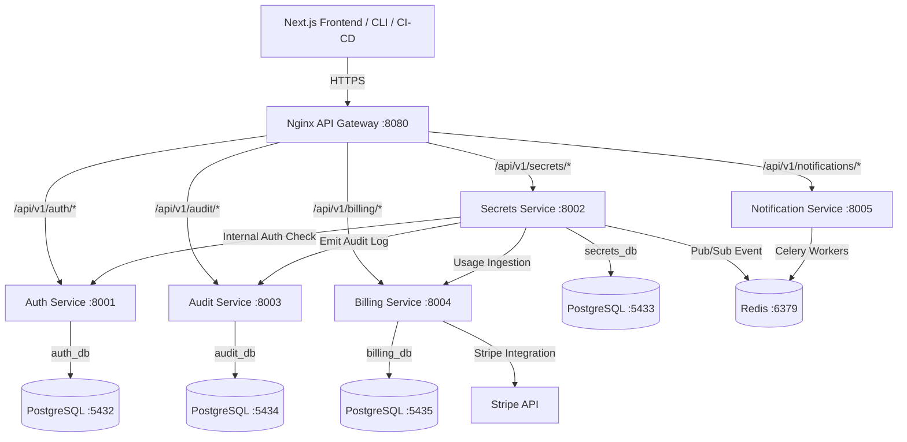

# EnvVault

> Centralized, multi-tenant secrets and environment variable management SaaS for development teams.

EnvVault allows engineering teams to centrally manage, encrypt, version, and audit-log all secrets and environment variables across multiple projects and deployment environments (development, staging, production, etc.).

---

## 🏗️ System Architecture

EnvVault is built using a modern **microservices architecture** with a Next.js frontend, an Nginx API Gateway, and independent Django REST Framework backend services. 



### Communication Patterns
* **Synchronous REST:** External clients access microservices via the Nginx API gateway (`:8080`). Internal service-to-service calls use direct HTTP client requests.
* **Asynchronous Tasks:** Celery workers powered by a Redis broker process background operations like sending notifications, processing webhooks, and syncing billing metrics.
* **Event-Driven Pub/Sub:** Redis Pub/Sub communicates secret change events to the billing and notification services.

---

## ✨ Features

- **🔐 Enterprise-Grade Envelope Encryption:** Secrets are encrypted on the write path using AES-256-GCM. Each organization gets a unique key generated using `cryptography` that is never stored in the database.
- **🔄 Secret Versioning & Rollback:** Every update automatically increments the version number. Easily view history and rollback to a previous version with a single click.
- **📁 Import/Export:** Import `.env` files directly or export secrets back to a `.env` format.
- **📋 Immutable Audit Logs:** Access logs detailing who read, updated, or exported a secret. Every operation is pushed to the append-only `audit-service`.
- **💳 Metered Billing:** Integrated Stripe billing. Free tier included, with usage-based meters tracking secret reads.
- **💻 Developer CLI & Integrations:** Pull secrets directly into local development or integrate with GitHub Actions, GitLab CI, and Kubernetes.

---

## 📂 Project Directory Structure

```directory
EnvVault/
├── cli/                        # Python CLI implementation (`envvault`)
│   ├── envvault_cli/           # CLI source code
│   └── setup.py                # Package setup script
├── frontend/                   # Next.js 14 Web UI App (App Router + Tailwind CSS)
│   ├── app/                    # Pages, layouts, and route handlers
│   ├── components/             # Reusable UI elements (Zustand state + React Hook Form)
│   └── store/                  # Zustand global state configurations
├── services/                   # Django REST Framework Backend Microservices
│   ├── auth-service/           # User registration, JWT tokens, RBAC, Organizations (:8001)
│   ├── secrets-service/        # Encryption/decryption, versions, CRUD (:8002)
│   ├── audit-service/          # Ingestion of events, append-only logger (:8003)
│   ├── billing-service/        # Stripe-integrated usage metrics & subscription plans (:8004)
│   └── notification-service/   # Slack integrations, webhooks, and email notifications (:8005)
├── infra/                      # Orchestration & Infrastructure Configs
│   ├── nginx/                  # Nginx configuration acting as the API Gateway
│   └── k8s/                    # Kubernetes Deployments, Services, HPAs, and ConfigMaps
└── docker-compose.yml          # Local multi-container development orchestrator
```

---

## 🛠️ Getting Started

### Prerequisites
Make sure you have the following installed on your machine:
* [Docker](https://www.docker.com/) and [Docker Compose](https://docs.docker.com/compose/)
* [Node.js](https://nodejs.org/) (v18+ recommended)
* [Python 3.10+](https://www.python.org/)

### Installation & Local Setup

1. **Clone the Repository:**
   ```bash
   git clone https://github.com/your-org/EnvVault.git
   cd EnvVault
   ```

2. **Configure Environment Variables:**
   Copy the example environment file and configure secrets as needed:
   ```bash
   cp .env.example .env
   ```

3. **Start the Platform via Docker Compose:**
   Deploy the database containers, Redis, microservices, frontend, and API Gateway:
   ```bash
   docker-compose up --build
   ```

4. **Verify the Running Containers:**
   Once services start, they are available on the following local ports:
   * **API Gateway:** `http://localhost:8080/api/v1`
   * **Web Frontend:** `http://localhost:3000`
   * **Auth Service:** `http://localhost:8001`
   * **Secrets Service:** `http://localhost:8002`
   * **Audit Service:** `http://localhost:8003`
   * **Billing Service:** `http://localhost:8004`
   * **Notification Service:** `http://localhost:8005`
   * **Redis:** `localhost:6379`

---

## 🔒 Security & Encryption Design

EnvVault implements a dual-key envelope encryption strategy:
1. **Secret Key (Database):** Encrypted value and IV (Initialization Vector) are stored in the database.
2. **Organization Key (KMS/Environment):** The key used to decrypt the data is stored in AWS KMS or as a base64 environment variable `ORG_KEY_DEFAULT` (locally) and is *never* persisted to the PostgreSQL database.

#### Encryption Helper Example:
```python
from cryptography.hazmat.primitives.ciphers.aead import AESGCM
import os, base64

def encrypt(plaintext: str, key_b64: str) -> tuple[str, str]:
    key = base64.b64decode(key_b64)
    iv = os.urandom(12)  # 96-bit nonce
    aesgcm = AESGCM(key)
    ct = aesgcm.encrypt(iv, plaintext.encode(), None)
    return base64.b64encode(ct).decode(), base64.b64encode(iv).decode()
```

---

## 💻 Developer CLI Usage

The EnvVault CLI allows developers to pull secrets down directly into local environment files or inject them into local shells.

1. **Install the CLI:**
   ```bash
   cd cli
   pip install -e .
   ```

2. **Login and Select Project:**
   ```bash
   envvault login --url http://localhost:8080
   envvault init --project my-project --env development
   ```

3. **Pull Secrets:**
   ```bash
   envvault pull -o .env
   ```
